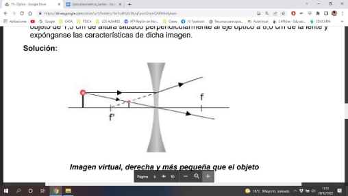

---
slug: opticageometrica_lentes
title: OPTICA GEOMETRICA DE LENTE
date: 2022-09-11
authors: examenEbau
tags: [fisica, lente]
---
**Refracción en lentes delgadas**

En óptica recibe el nombre de ***dioptrio*** cualquier superficie que separe dos medios con distinto índice de  refracción.

La superficie del agua o del vidrio es un dioptrio plano. Además del plano, el dioptrio más común (debido a su facilidad de fabricación) es el ***dioptrio esférico,*** la mayor parte de las lentes están limitadas por  superficies esféricas.

Los dioptrios esféricos tienen dos focos: 

<!-- truncate -->

***El foco imagen (F’)*** es el punto en el que, tras refractarse, coinciden los rayos que llegan al dioptrio en dirección paralela al eje óptico. Es la imagen correspondiente a un punto situado en el infinito.

***El foco objeto (F)*** es el punto que tras pasar los rayos por él se refractan paralelos al eje óptico. La imagen del foco objeto está situada en el infinito.

En un ***dioptrio convexo*** el foco imagen está situado a la derecha y el foco objeto a la izquierda.

En un ***dioptrio cóncavo*** los focos objeto e imagen están situados al revés que en uno convexo: el foco imagen se sitúa a la izquierda y el foco objeto a la derecha.

***Una lente*** es un sistema óptico limitado por dos dioptrios de los cuales uno, al menos, es esférico. La desviación del rayo es consecuencia de la refracción en ambos dioptrios, aunque en las ***lentes delgadas*** se considera que la desviación del rayo tiene lugar en el centro de la lente.

Izquierda: lente divergente (bicóncava)

Derecha: lente convergente (biconvexa)

En las lentes convergentes los rayos se refractan y emergen aproximándose al eje de la lente. En las divergentes el rayo emerge alejándose del eje de la lente. El que una lente

sea convergente o divergente  depende de su geometría.

Lentes divergentes

Lentes convergentes

***Los focos de una lente*** son puntos característicos de las mismas, que están situados simétricamente  respecto del centro de la lente.

Una lente tiene dos focos: el ***foco objeto*** y el ***foco imagen*** (ver figura).

- ***El foco objeto (f) es un punto del eje óptico tal que todo rayo que incide en la lente pasando por  él se refracta paralelamente al eje de la lente (imagen en el infinito)***
- ***El foco imagen (f') es el punto del eje óptico por el que pasa todo rayo refractado resultado de  una incidencia paralela al eje de la lente.***
- En una lente convergente el foco objeto se sitúa a la izquierda y el foco imagen a la derecha. ∙ En una lente divergente el foco objeto se sitúa a la derecha y el foco imagen a la izquierda.

 

Si suponemos que el espesor de la lente es pequeño (lentes delgadas) se pueden considerar los siguientes  rayos característicos:

- T***odo rayo que incida pasando por el foco objeto se refracta paralelamente al  eje de la lente.***
  - ***Cualquier rayo paralelo al eje de la lente se refracta pasando por el foco imagen.***
- ***Cualquier rayo que incida pasando por el centro de la lente no sufre refracción  alguna.***

La distancia focal de una lente delgada situada en el aire depende del índice de refracción de la lente y de los radios de curvatura de sus superficies:

1 = ( − 1)( 1 − 1 )

- 1 2

donde f’ es la distancia focal imagen, n es el índice de refracción de la lente y R1 y R2 son los radios

respectivos de cada una de las caras de la lente.

La ecuación que relaciona distancia objeto (s), distancia imagen (s') y distancia focal imagen (f'), para las  lentes delgadas es:

Los criterios de signos son análogos a 1 − 1 = 1 los fijados para los espejos: ***positivo***

- ' hacia la derecha y hacia arriba, ***negativo*** a la  izquierda y hacia abajo

***Se define la potencia de una lente como la inversa de su distancia focal imagen.***

La potencia de una lente está relacionada con su capacidad para hacer converger o divergir los rayos de  luz. A mayor potencia mayor capacidad de convergencia o divergencia de los rayos. Las lentes con mayor  potencia tienen una distancia focal corta.

La unidad en el Sistema Internacional es la ***dioptría (D) que se define como la potencia de una lente que  tenga un metro de distancia focal***

Para sistemas formados por varias 1 lentes la potencia se obtiene sumando

- ' la potencia de las lentes que integran el sistema.

La potencia de una lente biconvexa será positiva (f’ es positiva), mientras que en una lente bicóncava, la potencia será negativa (f’ es negativa).

Para  lentes simétricas (con los dos radios iguales) se cumple que = 2.( −1) Para calcular el ***aumento lateral*** de la imagen formada por una lente:

- ' = '

Las imágenes en las lentes delgadas se obtienen a partir del trazado de los rayos característicos. La imagen se formará en el punto en el que se corten los rayos (imagen real) o sus prolongaciones (imagen virtual)

**Rayos característicos en lentes**

- Rayo paralelo al eje se refracta pasando por el foco imagen (f').
- Rayo que pasa por el centro óptico de la lente, no se refracta.
- Rayo que pasa por el foco objeto (f) se refracta paralelo al eje.

**Ejemplo 1**

Usando una lente convergente con distancias focales f = f ' = 4,0 cm, mediante un diagrama de rayos, determine la posición y el aumento lateral de la imagen que produce dicha lente de un objeto de 1,5 cm de altura situado perpendicularmente al eje óptico a 6,0 cm de la lente y  expónganse las características de dicha imagen.

**Solución: **

*Imagen real, invertida y mayor que el objeto*

**Ejemplo 2**

Usando una lente divergente con distancias focales f = f ' = 5,0 cm, mediante un diagrama de rayos, determine la posición y el aumento lateral de la imagen que produce dicha lente de un objeto de 1,5 cm de altura situado perpendicularmente al eje óptico a 8,0 cm de la lente y  expónganse las características de dicha imagen.

**Solución:**

*Imagen virtual, derecha y más pequeña que el objeto*
